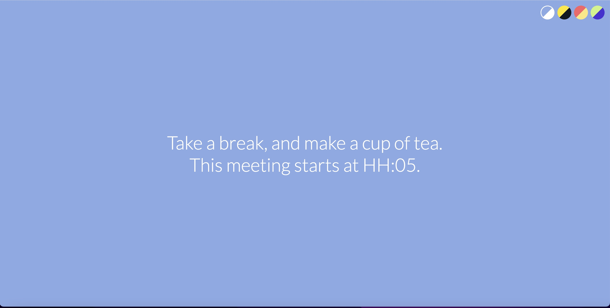

## Be Right Back!

I was looking for a simple side-project that would have allowed me to try and play a little with Vercel, and I  recollected an idea I read some years ago but don't remember when and where; I know it was right after Covid hit, and many people where starting to suffer from the so-called "Zoom Fatigue".

You might remember: back in those days, the usual daily routine was back-to-back meetings, and the idea of giving back some time at the beginning of a call was something I thought was nice, and smart.

So basically, it works like this: let's say that your meeting starts at HH:MM, but you know that other participants might have had one (or multiple) calls before so that they might arrive late, and a little break might be helpful (and appreciated).

What you can do, as an organizer, is write a message which says something like "Take a break, make a cup of tea; this meeting starts at HH:05" and share it full-screen.

This simple project helps you with this: it's just an empty full-screen document where you can only write a message and select a handful of UI properties (mainly colours, to be honest).  
Nothing more.  
Keep it simple.

You can check this tool [here](https://be-right-back.vercel.app/).

P.s.: also, I built this side-project because I wanted to write some code without committing to a long and complex project.
